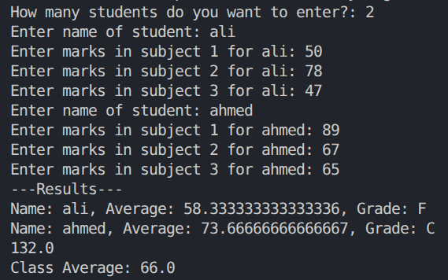

# Day 1 — Python & AI/ML Fundamentals

## Overview
The first task of the bootcamp — building a foundation in core AI/ML concepts 
and basic Python programming before touching any real datasets or models.

## Requirements
- Explain what AI, Machine Learning, Deep Learning, and Generative AI are, with a real-world example of each
- Build a Python project that:
  - Takes information from the user
  - Stores it using variables/lists
  - Uses if/else conditions
  - Uses a loop
  - Uses at least one function
  - Displays the final output

## What I built
A **Student Grade Calculator** — takes each student's name and marks in 3 subjects, 
calculates their average, assigns a letter grade (A/B/C/F) via a dedicated function, 
and prints a full class summary.

## Files
| File | Description |
|---|---|
| `Theory.txt` | Writeup on AI, ML, DL, and Generative AI, each with a real-world example |
| `grade-calculator.py` | The grade calculator project |

## Tech stack
Python 3.12 (standard library only — no external packages needed)

## How to run
```bash
uv run python "Day 1/grade-calculator.py"
```

## Sample output


## What I learned
Functions and `return` values, list-of-dictionaries as a way to group related records, 
and using `if/elif/else` chains for classification logic.