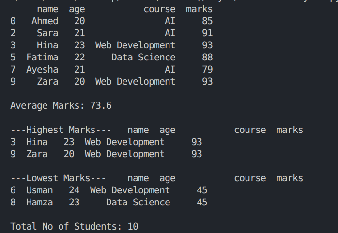

# Day 2 — Pandas & DataFrames

## Overview
First introduction to Pandas — moving from plain Python lists/dicts to a proper 
tabular data structure, and using it to filter and analyze data instead of writing 
manual loops.

## Requirements
- Create a dataset of at least 10 students (name, age, course, marks)
- Convert it into a Pandas DataFrame
- Display all students
- Display students with marks above 70
- Calculate the average marks
- Find the student(s) with the highest and lowest marks
- Display the total number of students

## What I built
A script that builds a 10-student dataset, converts it into a Pandas DataFrame, 
and runs all the required filters and calculations — including handling ties 
correctly for highest/lowest marks (showing every student at that score, not 
just one).

## Files
| File | Description |
|---|---|
| `student_analysis.py` | Builds the dataset and runs the DataFrame analysis |

## Tech stack
Python 3.12 · Pandas

## How to run
```bash
uv run python "Day 2/student_analysis.py"
```

## Sample output


## What I learned
DataFrames and their auto-generated index, boolean filtering (`df[df["col"] > x]`), 
`.mean()`, and handling tied values correctly instead of arbitrarily picking one 
result with `.max()`/`.min()`.